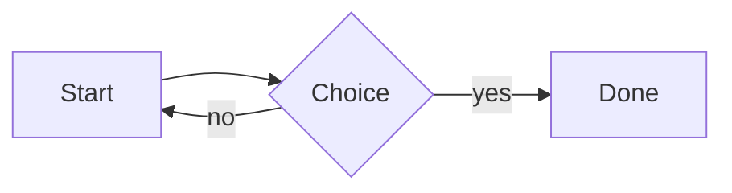
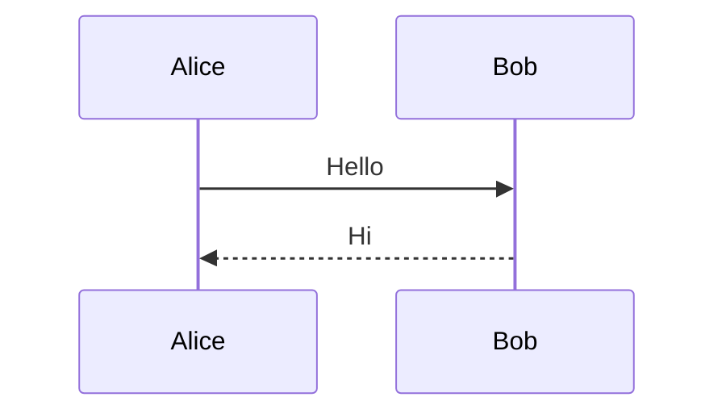

# Export & <Escaping> "quotes"

Inline math $E = mc^2$ and $\frac{a}{b} + \sqrt{x}$, a broken formula $\frac{1}{$,
and an empty one $ $. Code `a < b && c > "d"` stays escaped.

$$
\int_0^1 x^2 \, dx = \frac{1}{3}
$$

$$
\mathop{\rm arg\,max}_{x} f(x) \quad \mathop{lim}_{n \to \infty}
$$

$$
\begin{bad
$$





```mermaid
this is not a diagram
```

```mermaid
```

## Callouts

> [!NOTE]
> A note with **bold**.

> [!TIP] Custom tip title
> Tip body.

> [!WARNING]
> Careful.

> [!CAUTION]
> Very careful.

> [!IMPORTANT]
> Read this.

> [!danger]- Folded danger
> Hidden by default.

> [!bug]
> A bug.

> [!question]
> Why?

> [!example]
> For example.

> [!quote]
> Someone said it.

## Lists

1. one
2. two

7. seven
8. eight

- [x] done with `code`
- [ ] not done
  - nested **item**

* loose item

  with a second paragraph

* another

## Table

| left | center | right | none |
|:-----|:------:|------:|------|
| a <b> | `c` | **d** | [e](e.md) |
| 1 | 2 | 3 |

## Links

[relative](other.md) [with anchor](other.md#part) [query](other.md?x=1)
[upper](OTHER.MD) [markdown ext](other.markdown) [dir](sub/) [root](/abs.md)
[scheme](vscode://open) [js](JavaScript:alert(1)) [data](data:text/html,x)
[http](http://example.com) [https](HTTPS://EXAMPLE.COM) [mail](mailto:a@b.c)
[titled](https://example.com "A \"title\" & more") [colon in path](dir/a:b.md)
[slash colon](./a:b) [empty]() <https://auto.example/?a=1&b=2> <javascript:alert(1)>
<foo@example.com>

[[Wiki Page]] [[folder/page|Label & <b>]] [[javascript:alert(1)//]] [[Data:x]]
[[http://example.com|web]]

Footnote reference[^n] and an unknown one[^missing].

[^n]: The footnote body with *emphasis*.

## Images

 
  
 
  

## Raw HTML

<div class="x"><script>alert(1)</script></div>

Inline <span style="color:red">html</span> and <br> tags.

---

Line with a hard break  
next line\
and another.

~~struck~~ *em* __strong__ ***both***

    indented code <tag>

```
fenced without a language
```

```js title="x"
const x = "<y>";
```

Path tokens: `src/main.rs:10`, ./scripts/build.sh and /usr/local/bin/tool.

## Repeats

The same formula twice, $E = mc^2$ and $E = mc^2$, and the first block again:

$$
\int_0^1 x^2 \, dx = \frac{1}{3}
$$


