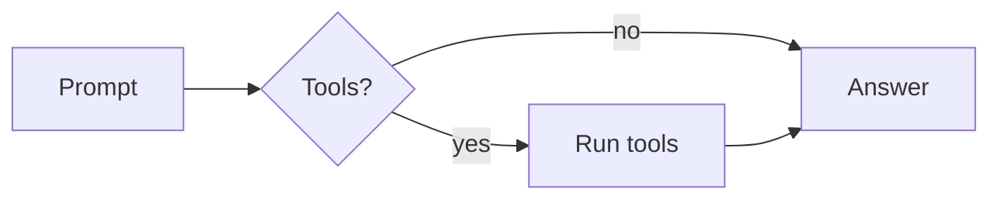
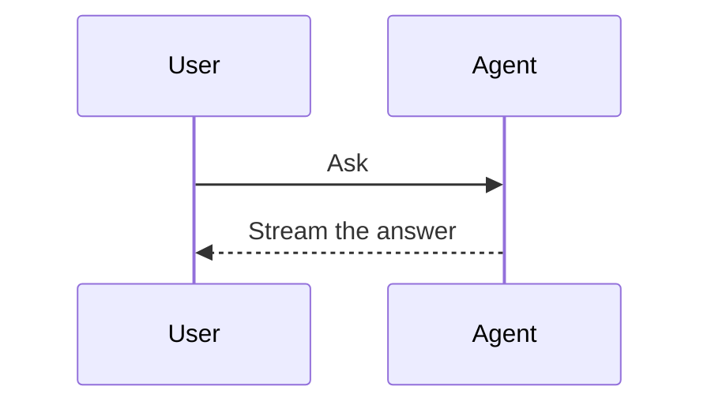
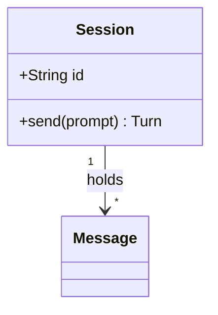
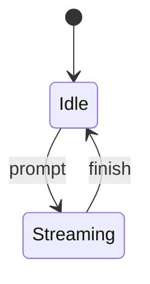
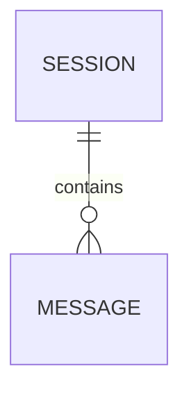
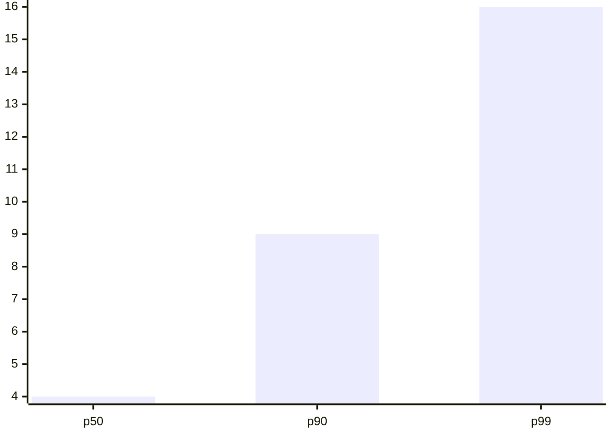

# Markdown stress test

One answer that touches every construct the transcript draws. Inline: **bold**, *italic*, ***both***, ~~struck~~, `inline code`, a [titled link](https://example.com/docs "Documentation"), an autolink <https://example.com>, a bare https://example.com/bare URL, a footnote[^timing], a wikilink [[Design notes]], a path `src/main.rs:42`, emoji 🚀 and **✅ bold emoji**, keys <kbd>⌘</kbd>+<kbd>K</kbd>, and a hard break here\
that continues on the next line. Café, naïve, Ελληνικά, 日本語, العربية, and a composed é.

## Lists

- An unordered item long enough to wrap past the measure, so the hanging indent under its marker is visible.
  - A nested item
    - A third level with `code`
- [x] A finished task
- [ ] An open task

3. An ordered list starting at three
4. A loose item with a second paragraph:

   The paragraph stays inside the item.
5. The last item

## Quotes and callouts

> A quotation with *emphasis*.
>
> > And a nested one.

> [!NOTE]
> A callout has an icon and a tint.

> [!WARNING]
> So does a warning.

## Code

```rust
/// Sum a slice without allocating.
fn total(values: &[u64]) -> u64 {
    values.iter().copied().sum()
}
```

```diff
- let width = 640.0;
+ let width = measure.min(720.0);
```

```json
{ "session": "mock", "streaming": true, "chunks": [1, 2, 3] }
```

    An indented code block, four spaces in.

## Table

| Stage | Owner | Time (ms) | Notes |
| :--- | :---: | ---: | --- |
| Parse | `markup` | 0.9 | CommonMark and GFM |
| Decorate | render | 2.4 | **Bold** and *italic* in a cell |
| Layout | TextKit | 12.75 | A long cell that wraps onto a second line inside the table |

---

## Math

Inline $e^{i\pi} + 1 = 0$ and $\sum_{k=1}^{n} k = \frac{n(n+1)}{2}$ share the line with text.

$$
\int_0^\infty e^{-x^2}\,dx = \frac{\sqrt{\pi}}{2}
$$

```math
\begin{pmatrix} a & b \\ c & d \end{pmatrix}^{-1} = \frac{1}{ad - bc} \begin{pmatrix} d & -b \\ -c & a \end{pmatrix}
```

## Diagrams













## Images and HTML


<details>
<summary>A folded detail</summary>

Hidden text with **Markdown** inside.

</details>

[^timing]: A footnote, defined at the end of the answer.
